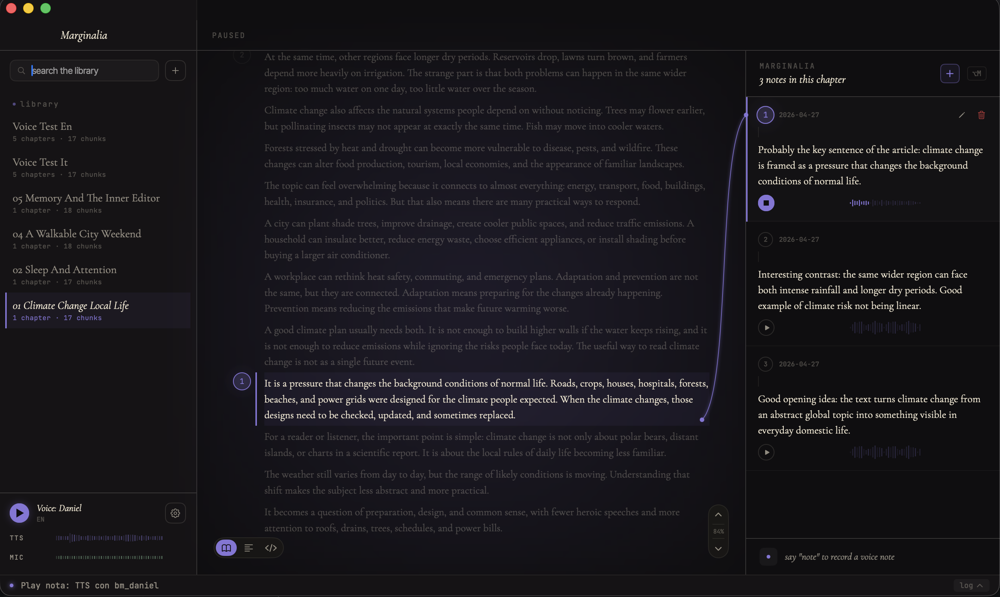
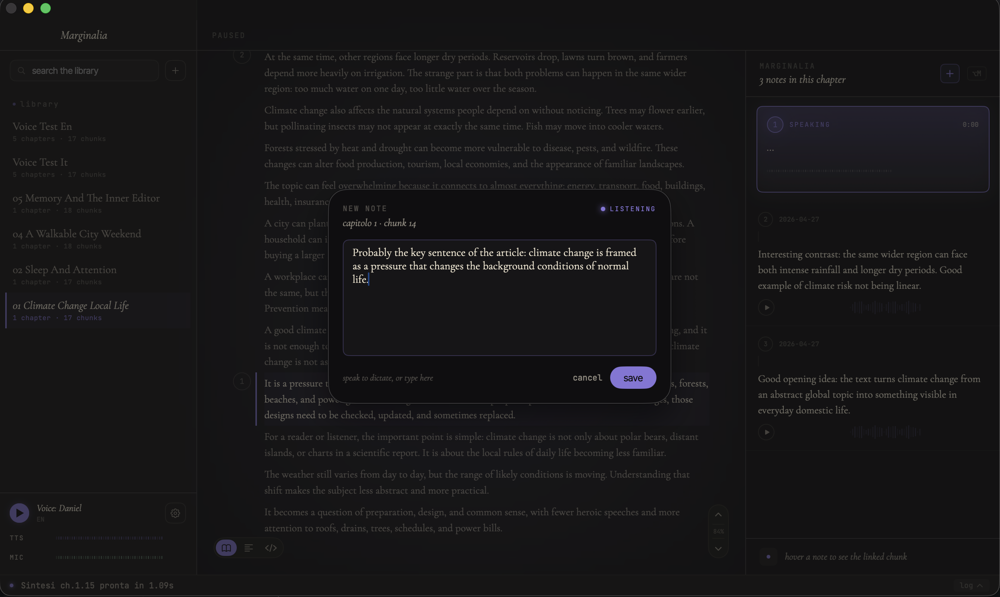
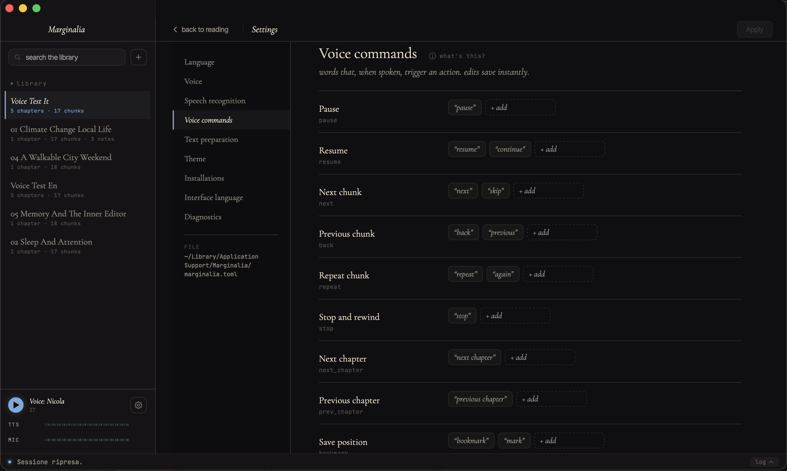
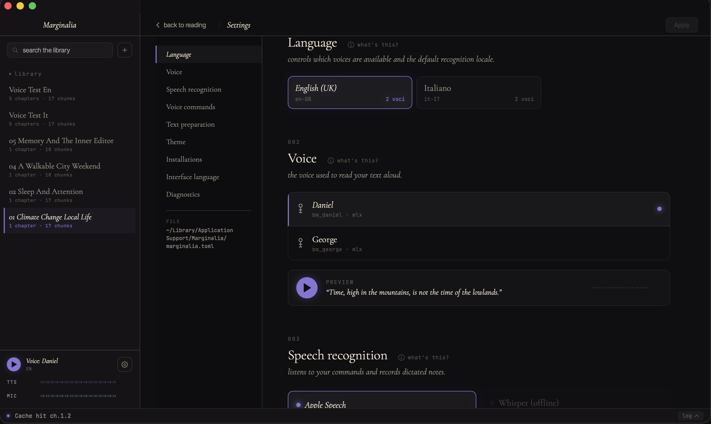

# Marginalia

**Listen to your documents, dictate notes — offline on your Mac.**

A voice-first reader for the macOS desktop: drop in a `.md`, `.txt`,
`.pdf`, `.epub` or a URL, and Marginalia reads it aloud while you do
something else, listens for short voice commands ("pause", "next",
"avanti", "ripeti"), and lets you dictate margin notes that stay
linked to the exact passage you were on.

Everything runs on-device. No accounts. No cloud. The mic and the
TTS engine are both local.



## What it does

- **Reads any document aloud** with on-device neural TTS (Kokoro
  82M via Apple MLX on Apple Silicon, ~1s latency per chunk).
- **Listens for voice commands** through Apple Speech (default) or
  Whisper, with WebRTC AEC3 echo-cancellation so the playback never
  triggers its own commands.
- **Captures voice notes** while you read — say "nota", dictate, the
  text and audio attach to the chunk you were on.
- **Remembers where you were** across restarts. Library, sessions,
  notes, bookmarks all live in a local SQLite store.
- **Italian + English** out of the box, with a per-language voice
  catalog you can extend from the in-app installer.

## Capture a thought without leaving the page

Say "nota" while reading. Marginalia opens a dictation overlay,
records the audio, transcribes it, and pins the result to the
chunk you were listening to — visible in the right margin and
playable back later.



## Control with your voice

Marginalia listens for short trigger words while you read. Every
core action has multiple synonyms, and you can add your own custom
triggers — they persist across interface-language switches.

| Action | Default triggers |
|---|---|
| pause | `pause` |
| resume | `resume`, `continue` |
| next chunk | `next`, `skip` |
| previous chunk | `back`, `previous` |
| repeat chunk | `repeat`, `again` |
| stop | `stop` |
| next chapter | `next chapter` |
| previous chapter | `previous chapter` |
| bookmark | `bookmark`, `mark` |
| dictate a note | `note` |
| where am I | `where`, `position` |

A separate Italian set ships with the app and activates when you
switch the interface language to Italian. Default triggers are
locked (you can't accidentally remove "pause"). Anything you add
through the editor is a **custom** trigger — visually distinct,
removable, and kept when you switch interface language.



## Settings

Themes, voices, STT engine selection, chunk size, and the local file
paths the app uses — all editable from the app.



## Install & run

### Mac app

The Mac app (SwiftUI + Rust core via FFI) is the primary surface.

```bash
git clone https://github.com/Gibbio/Marginalia.git
cd Marginalia

# Pre-download the TTS + STT model assets (one-time)
make bootstrap-beta

# Build the .app bundle (Apple Silicon only — needs Xcode + Metal)
make bundle-live

# Launch
open apps/mac-gui/build/Marginalia.app
```

First launch asks for microphone permission and walks you through
installing voices for your language.

### Terminal UI

For headless use or a quick test, the TUI runs the same engine:

```bash
make tui-rs        # auto-detects platform, enables MLX on arm64 macOS
```

On non-Apple-Silicon machines the TUI falls back to Kokoro ONNX
(cross-platform CPU, ~5.7 s/chunk) or to fake providers if no model
is installed.

## How it works (one paragraph)

Hexagonal architecture in Rust. A small `marginalia-core` defines
the domain types and trait-shaped ports (`SpeechSynthesizer`,
`CommandRecognizer`, `DocumentRepository`, …). Provider crates
implement those ports against real backends (MLX, ONNX,
SFSpeechRecognizer, Whisper, SQLite, rodio, AEC3). `marginalia-runtime`
composes them. Apps (`apps/tui-rs`, `apps/mac-gui`) construct the
runtime and route user input. The mac-gui talks to the runtime
through UniFFI bindings in `crates/marginalia-ffi`.

For the full picture (crate map, port traits, TTS critical path,
STT pipeline, FFI flow, where to look when…) see
[**`docs/architecture.md`**](docs/architecture.md).

## Engines

| Backend | Where | Latency / quality |
|---|---|---|
| Kokoro 82M via MLX Metal | macOS Apple Silicon | ~1 s / chunk, 12× realtime |
| Kokoro 82M via ONNX Runtime | Cross-platform CPU | ~5.7 s / chunk, 2.3× realtime |
| Apple Speech (SFSpeechRecognizer) | macOS | ~0.2 s, multilingual, near-zero CPU |
| Whisper (ggml-small) | Cross-platform | ~2 s, fully offline, ~460 MB model |
| WebRTC AEC3 | Always-on with Apple Speech | Pure-Rust port — no false trigger from playback |

## Build your own app

Marginalia is a library-first project. The Mac app is just one host;
you can wire the runtime into your own GUI / mobile / CLI in a few
lines.

```toml
[dependencies]
marginalia-runtime = { git = "https://github.com/Gibbio/Marginalia", features = ["host-playback"] }
marginalia-config  = { git = "https://github.com/Gibbio/Marginalia" }
# Optional: marginalia-runtime/{apple-stt, whisper-stt, mlx-tts, host-playback}
```

```rust
use marginalia_runtime::{RuntimeBuilder, RuntimeConfig};
use marginalia_config::*;

let output = RuntimeBuilder::new(".marginalia/app.sqlite3")
    .config(RuntimeConfig::default())
    .voice_commands(VoiceCommandsSection::default())
    .stt(SttSection::default())
    .mlx(MlxSection::default())
    .playback(PlaybackSection::default())
    .build()?;

let mut runtime = output.runtime;
```

Drive it through a JSON-shaped frontend API — same one the TUI and
mac-gui use:

```rust
runtime.execute_frontend_command("ingest_document", json!({ "path": "book.txt" }));
runtime.execute_frontend_command("start_session", json!({ "target": "book.txt" }));
let snap = runtime.execute_frontend_query("get_session_snapshot", json!({}));
```

Available commands (subset): `ingest_document`, `start_session`,
`pause_session`, `resume_session`, `next_chunk`, `previous_chunk`,
`next_chapter`, `previous_chapter`, `repeat_chunk`, `create_note`,
`restore_session`.

Available queries: `get_app_snapshot`, `get_session_snapshot`,
`get_document_view`, `list_documents`, `list_notes`,
`search_documents`, `search_notes`, `get_doctor_report`,
`get_backend_capabilities`.

Subscribe to typed events (`PlaybackFinished`, `ChunkAdvanced`,
`SessionRestored`, `SessionStopped`, `Error`) via channel or
callback.

## Build targets

```bash
cargo build --release                                          # default (no native deps)
cargo build --release -p marginalia-tui --features mlx-tts     # TUI with MLX TTS
make tui-rs                                                    # TUI auto-detect
make build-xcframework                                         # mac-gui FFI bindings
make bundle-live                                               # mac-gui .app bundle
cargo test                                                     # tests
```

`marginalia-tts-mlx` requires Xcode + Metal Toolchain on macOS.
`marginalia-stt-whisper` requires cmake + a C++ compiler.

## Bootstrap (model assets)

```bash
make bootstrap-beta       # all Beta providers
make bootstrap-kokoro     # Kokoro ONNX model + voices
make bootstrap-ort        # ONNX Runtime library
make bootstrap-whisper    # Whisper STT model
make beta-doctor          # verify setup
```

Apple STT needs no model download — it uses the Neural Engine via
`SFSpeechRecognizer`. Requires macOS Dictation to be enabled
(`System Settings → Keyboard → Dictation → ON`).

## Credits & upstream sources

Marginalia depends on excellent open-source work by other people.
The TTS/STT models, voices, and Rust bindings are not ours — we
wrap them, we don't redistribute the weights. Everything below is
downloaded on demand to the user's machine (HuggingFace cache or
per-asset path). Many thanks to the maintainers.

### Models & voices (downloaded by `make bootstrap-*` and the in-app installer)

| Asset | Source | License |
|---|---|---|
| Kokoro 82M (MLX, default on Apple Silicon) — weights `kokoro-v1_0.safetensors` and per-language voice embeddings under `voices/` | [`prince-canuma/Kokoro-82M`](https://huggingface.co/prince-canuma/Kokoro-82M) | Apache-2.0 |
| Kokoro 82M (ONNX, cross-platform fallback) — `onnx/model_q8f16.onnx` | [`onnx-community/Kokoro-82M-v1.0-ONNX`](https://huggingface.co/onnx-community/Kokoro-82M-v1.0-ONNX) | Apache-2.0 |
| Kokoro reference G2P (the phonemizer rules `marginalia-tts-mlx` mirrors clause-by-clause) | [`hexgrad/misaki`](https://github.com/hexgrad/misaki) | MIT |
| Whisper STT — `ggml-small.bin` and the rest of the ggml family | [`ggerganov/whisper.cpp`](https://huggingface.co/ggerganov/whisper.cpp) | MIT |
| Voice catalog HF API endpoint hit by Settings → Installations → "Refresh voice list" | `https://huggingface.co/api/models/prince-canuma/Kokoro-82M/tree/main/voices` | (HF public API) |

### Build dependencies that aren't on crates.io

| Crate | Source | What it gives us |
|---|---|---|
| `voice-tts`, `voice-nn`, `voice-dsp` | [`Gibbio/voice-mlx`](https://github.com/Gibbio/voice-mlx) (fork with patched decoder) | The Kokoro inference path on MLX Metal that powers `marginalia-tts-mlx` |
| `mlx-rs` | [`oxideai/mlx-rs`](https://github.com/oxideai/mlx-rs) (git HEAD — crates.io v0.25.3 bundles an older MLX C++ that's noticeably slower) | Rust bindings for Apple's MLX framework |

### Runtime dependencies (audio / NLP / I/O) worth calling out

| Crate | What it does |
|---|---|
| [`rodio`](https://crates.io/crates/rodio) (0.22) | Audio playback for the TUI and CLI; the mac-gui uses `AVAudioPlayer` for chunks/notes/preview and only goes through rodio in `marginalia-playback-host` for shared sink ownership |
| [`cpal`](https://crates.io/crates/cpal) (0.17) | Cross-platform audio device access (mic capture for the AEC pipeline, speaker output for rodio) |
| [`aec3`](https://crates.io/crates/aec3) | Pure-Rust port of WebRTC AEC3 — keeps the TTS playback from triggering its own voice commands |
| [`whisper-rs`](https://crates.io/crates/whisper-rs) (0.16) | Whisper.cpp Rust bindings used by `marginalia-stt-whisper` |
| [`hf-hub`](https://crates.io/crates/hf-hub) (0.5) | HuggingFace cache layout + downloads with progress |
| [`pdfium`](https://github.com/bblanchon/pdfium-binaries) | PDF text extraction (PDFium binaries — Apache-2.0 / BSD) |
| [`espeak-ng`](https://github.com/espeak-ng/espeak-ng) | External phonemizer used by both TTS backends, called clause-by-clause |
| [`epub`](https://crates.io/crates/epub) | Pure-Rust EPUB 2/3 parser used by `marginalia-import-epub` |
| [`readability-rust`](https://crates.io/crates/readability) + [`scraper`](https://crates.io/crates/scraper) + [`ureq`](https://crates.io/crates/ureq) | The `marginalia-import-url` web-article importer |
| Apple `SFSpeechRecognizer` (system framework) | Native multilingual STT used by `marginalia-stt-apple`'s Swift helper |

If your project is in this list and you'd like the credit phrased
differently — or removed — open an issue and we'll fix it.
